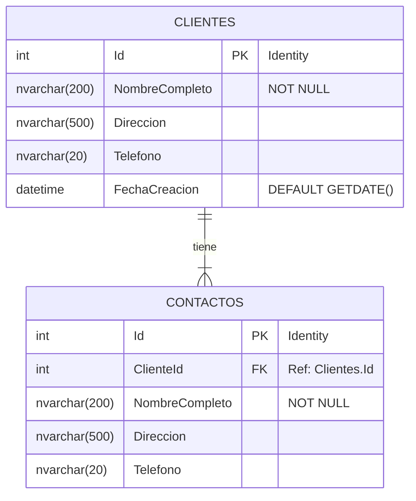

# Diagrama de Entidad-Relación (MER)

## Descripción de Tablas

### Tabla: Clientes
Almacena la información principal de los clientes.
- **Id**: Identificador único autoincremental.
- **NombreCompleto**: Nombre completo del cliente (Obligatorio).
- **Direccion**: Dirección física.
- **Telefono**: Número de contacto.
- **FechaCreacion**: Fecha de registro del cliente (Automático).

### Tabla: Contactos
Almacena los contactos asociados a un cliente específico.
- **Id**: Identificador único autoincremental.
- **ClienteId**: Clave foránea que relaciona con la tabla Clientes.
- **NombreCompleto**: Nombre del contacto (Obligatorio).
- **Direccion**: Dirección del contacto.
- **Telefono**: Teléfono del contacto.
